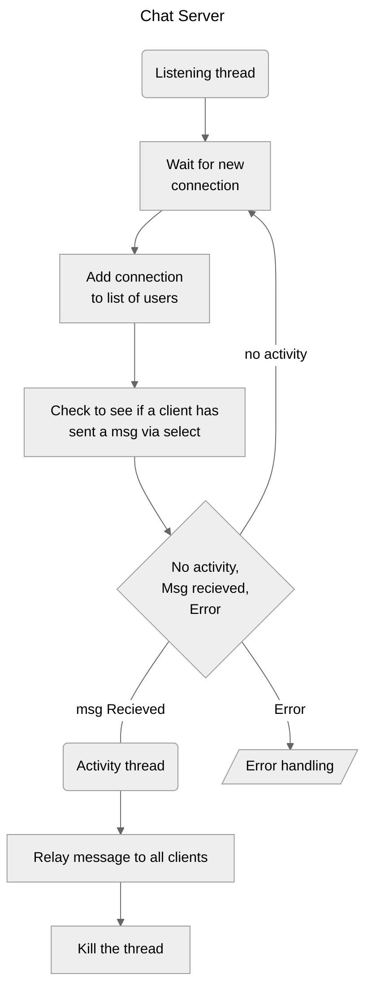

# ConsoleChat

A simple terminal based chat program

---

The idea I have for implementing the application is as follows

```mermaid
---
title: Chat Server
config:
    look: classic
    theme: neutral
---
flowchart TD
    A("`Listening thread`")
	B("`Activity thread`")
	
	A --> C["`Wait for new
	connection`"]
	C --> D["`Add connection 
to list of users`"]
	D --> E["`Check to see if a client has
 sent a msg via select`"]
	E --> F{"`No activity, 
 Msg recieved,
 Error`"}
	F -->|no activity| C
	F ---|msg Recieved| B
	F -->|Error| G[/Error handling/]
	
	B --> H["`Relay message to all clients`"]
	H --> I["`Kill the thread`"]
	
```
