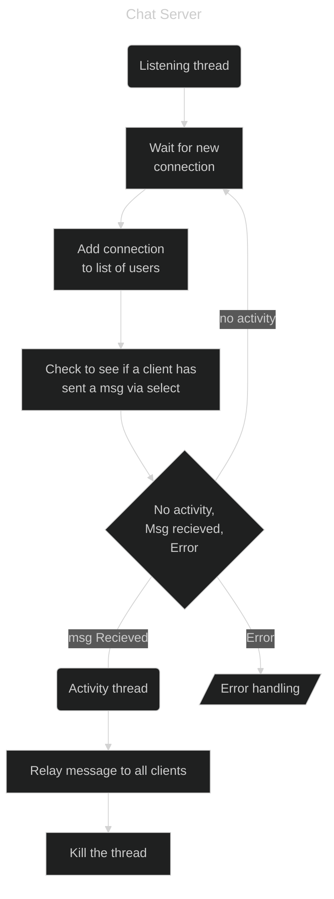

# ConsoleChat

A simple terminal based chat program

---

The idea I have for implementing the application is as follows

---

I was thinking of implementing it in a way where the client AND server are integrated into one .exe. 
To determine which one launches, I was thinking about using argument flags and or startup user input for it 
i.e. `consolechat.exe --server --port 7777 -p SuperSecretPassword` would start a server on port 7777 with the password of 'SuperSecretPassword'. 
Another idea I was thinking about for security is using a config file with most of the secrets inside it. 
For example `consolechat.exe -c path/to/some.conf` and `some.conf` would contain the flags separated by spaces or newlines. 
